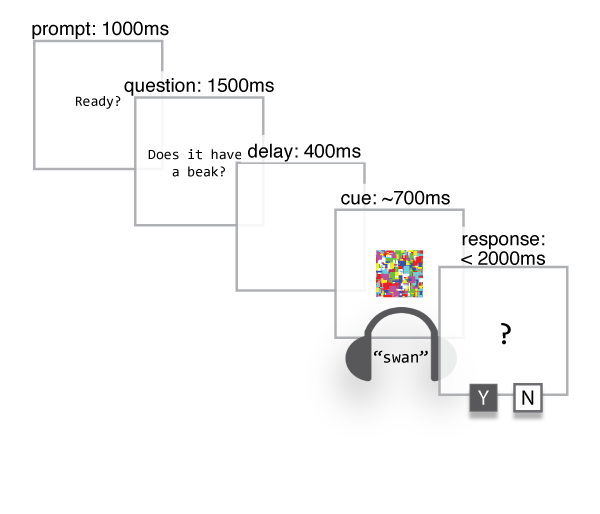

Property verification
=====================
author: Pierce Edmiston
date: 3/31/16
css: theme.css


Experiment
==========
type: center

> Does visual knowledge depend on visual mechanisms?

</img>

IV: Feature type
================
Is the question asking about
a visual feature or a nonvisual feature? Nonvisual features are
more accurately described as _encyclopedic features_.

```
  feat_type feat_c             feat_label
1 nonvisual   -0.5 Encyclopedic Knowledge
3    visual    0.5       Visual Knowledge
```

IV: Mask type
=============
Whether or not visual interference, aka the _mask_, was present
on the trial. Nomask trials are more accurately described as _Blank
screen_ trials.

```
  mask_type mask_c          mask_label
1    nomask   -0.5        Blank screen
2      mask    0.5 Visual interference
```

IV: Truth
=========
Is the correct answer to the question "yes" or "no"?
